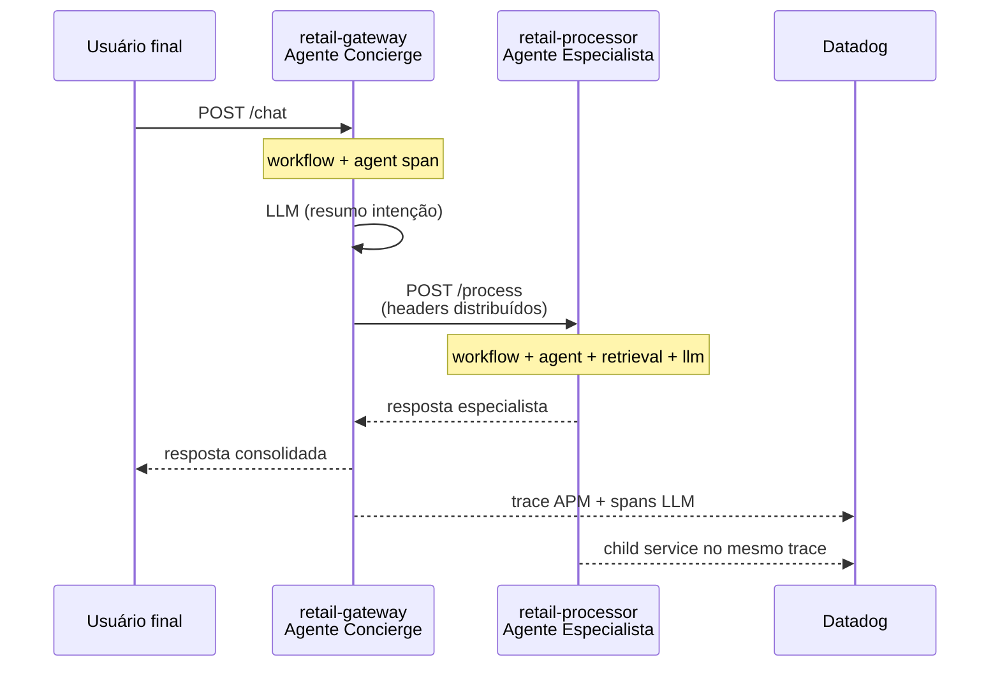

# LLM Multi-Agent Retail — Datadog APM + LLM Observability

Exemplo de ecossistema **retail** com dois agentes LLM em **microserviços distintos**, instrumentados para aparecerem como **multi-service no APM** e, ao mesmo tempo, como **um único fluxo no LLM Observability**.

## Arquitetura



| Componente | `DD_SERVICE` (APM) | Papel |
|------------|-------------------|--------|
| Gateway | `retail-gateway` | Agente 1 — recebe o usuário, resume intenção, delega |
| Processor | `retail-processor` | Agente 2 — consulta contexto retail (mock ERP) e responde |

Ambos compartilham **`DD_LLMOBS_ML_APP=retail-assistant`** para a visão **unificada no LLM Observability** (workflow → agent → task → retrieval → llm).

## Pré-requisitos

- Python 3.10+
- Conta Datadog com [LLM Observability](https://www.datadoghq.com/product/ai/llm-observability/) habilitada
- `DD_API_KEY` e `DD_SITE` configurados

## Execução local

```bash
python -m venv .venv
source .venv/bin/activate
pip install -r requirements.txt
cp .env.example .env
# Edite .env com DD_API_KEY e DD_SITE
set -a && source .env && set +a
```

Terminal 1 — especialista (porta 8002):

```bash
./scripts/run_processor.sh
```

Terminal 2 — concierge (porta 8001):

```bash
./scripts/run_gateway.sh
```

Terminal 3 — demo:

```bash
python scripts/demo_client.py
```

## Docker Compose (Agent + ambos serviços)

```bash
cp .env.example .env
# Preencha DD_API_KEY
docker compose up --build
python scripts/demo_client.py
```

## O que observar no Datadog

### LLM Observability (visão unificada)

1. Acesse **LLM Observability** → aplicação **`retail-assistant`**
2. Abra um trace da execução — você verá a cadeia completa:
   - `workflow` — `retail-customer-chat` (gateway)
   - `agent` — `retail-concierge`
   - `task` — `enrich-user-intent`
   - `llm` — inferência do concierge
   - `workflow` — `retail-backoffice-process` (processor, mesmo trace via propagação)
   - `agent` — `retail-specialist`
   - `retrieval` — `retail-knowledge-base`
   - `llm` — inferência do especialista

### APM (multi-service)

No **APM → Traces**, filtre por trace da requisição `/chat`:

- Serviço **`retail-gateway`**: span HTTP `POST /chat` e spans LLM do concierge
- Serviço **`retail-processor`**: span HTTP `POST /process` ligado como **downstream** no mesmo `trace_id`

Use **Service Map** para ver a dependência `retail-gateway` → `retail-processor`.

## Propagação de contexto

O gateway injeta headers com `LLMObs.inject_distributed_headers()` na chamada HTTP ao processor. O processor ativa o contexto no middleware **antes** de qualquer span:

```python
LLMObs.activate_distributed_headers(dict(request.headers))
```

Isso une o `llmobs_parent_id` entre serviços mantendo o mesmo `ml_app`.

## Modo mock vs OpenAI

| Variável | Comportamento |
|----------|----------------|
| `USE_MOCK_LLM=auto` (padrão) | Mock se `OPENAI_API_KEY` estiver vazio |
| `USE_MOCK_LLM=true` | Sempre mock (útil para demos sem custo) |
| `USE_MOCK_LLM=false` | Exige `OPENAI_API_KEY` |

## Variáveis principais

```bash
DD_LLMOBS_ENABLED=1
DD_LLMOBS_ML_APP=retail-assistant   # igual nos 2 serviços
DD_SERVICE=retail-gateway           # ou retail-processor
DD_LLMOBS_AGENTLESS_ENABLED=true    # local sem Agent; com Agent use false
PROCESSOR_URL=http://localhost:8002
```

## Estrutura do repositório

```
├── common/                 # LLM client, config, dados retail mock
├── services/
│   ├── gateway/            # Agente 1 + API /chat
│   └── processor/          # Agente 2 + API /process
├── scripts/                # run_*.sh e demo_client.py
├── docker-compose.yml
└── Dockerfile
```

## Cenário de teste sugerido

```bash
python scripts/demo_client.py --message "Status do pedido BR-10482 e estoque do SKU-7781"
```

Perguntas sobre pedidos, estoque e políticas de troca disparam o fluxo completo entre os dois agentes.
