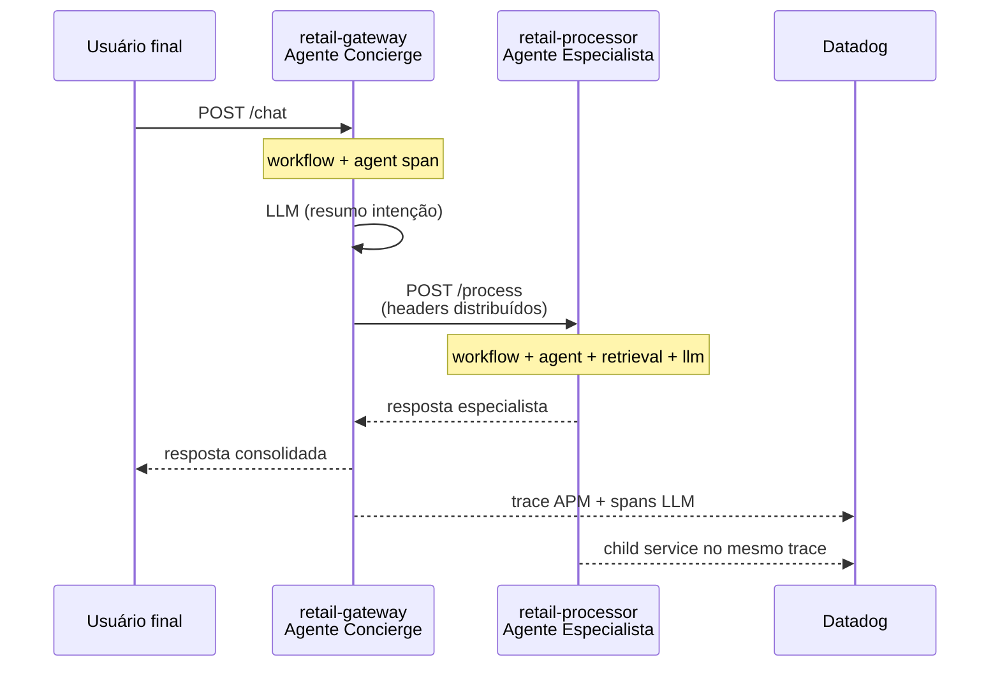
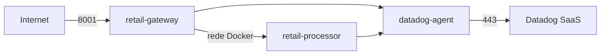

# LLM Multi-Agent Retail — Datadog APM + LLM Observability

Exemplo de ecossistema **retail** com dois agentes LLM em **microserviços distintos**, instrumentados para aparecerem como **multi-service no APM** e, ao mesmo tempo, como **um único fluxo no LLM Observability**.

## Arquitetura



| Componente | `DD_SERVICE` (APM) | Papel |
|------------|-------------------|--------|
| Gateway | `retail-gateway` | Agente 1 — recebe o usuário, resume intenção, delega |
| Processor | `retail-processor` | Agente 2 — consulta contexto retail (mock ERP) e responde |

Ambos compartilham **`DD_LLMOBS_ML_APP=retail-assistant`** para a visão **unificada no LLM Observability** (workflow → agent → task → retrieval → llm).

## Pré-requisitos

- Python 3.10+
- Conta Datadog com [LLM Observability](https://www.datadoghq.com/product/ai/llm-observability/) habilitada
- `DD_API_KEY` e `DD_SITE` configurados

## Execução local

```bash
python -m venv .venv
source .venv/bin/activate
pip install -r requirements.txt
cp .env.example .env
# Edite .env com DD_API_KEY e DD_SITE
set -a && source .env && set +a
```

Terminal 1 — especialista (porta 8002):

```bash
./scripts/run_processor.sh
```

Terminal 2 — concierge (porta 8001):

```bash
./scripts/run_gateway.sh
```

Terminal 3 — demo:

```bash
python scripts/demo_client.py
```

## Docker Compose (desenvolvimento local)

Expõe as portas **8001** e **8002** para debug.

```bash
cp .env.example .env
# Preencha DD_API_KEY
docker compose up --build
python scripts/demo_client.py
```

## Deploy na AWS EC2

Recomendado para servidor: **`docker-compose.prod.yml`** — apenas o gateway fica público na porta **8001**; o processor comunica só pela rede Docker; o Datadog Agent escuta em `127.0.0.1:8126`.

### 1. Instância e Security Group

| Item | Sugestão |
|------|----------|
| AMI | Amazon Linux 2023 ou Ubuntu 22.04 |
| Tipo | `t3.small` ou superior |
| Inbound | SSH (22) do seu IP; TCP **8001** (gateway) |
| Não abrir | Porta **8002** (processor interno) |
| Outbound | HTTPS (443) para Datadog e OpenAI |

Opcional: **Elastic IP** para IP fixo.

### 2. Bootstrap na EC2

```bash
ssh -i sua-chave.pem ec2-user@<IP_PUBLICO>

# Opção A — script de setup (Amazon Linux / Ubuntu)
git clone <URL_DO_REPO> LLM_MultiAgent
cd LLM_MultiAgent
chmod +x scripts/ec2-setup.sh
./scripts/ec2-setup.sh
# Reconecte o SSH se o script adicionou seu usuário ao grupo docker

# Opção B — manual
sudo dnf install -y docker git    # Amazon Linux
sudo systemctl enable --now docker
sudo usermod -aG docker $USER
```

### 3. Configurar ambiente

```bash
cd ~/LLM_MultiAgent
cp deploy/.env.ec2.example .env
nano .env   # DD_API_KEY, DD_SITE, DD_ENV=aws-ec2
```

### 4. Subir em produção

Use o wrapper `./scripts/compose.sh` (detecta `docker compose` v2 ou `docker-compose` v1):

```bash
./scripts/compose.sh -f docker-compose.prod.yml up -d --build
./scripts/compose.sh -f docker-compose.prod.yml ps
./scripts/compose.sh -f docker-compose.prod.yml logs -f retail-gateway
```

#### Erro `unknown shorthand flag: 'f' in -f`

O Docker está instalado, mas falta o **plugin Compose v2**. Na EC2 (Amazon Linux):

```bash
sudo dnf install -y docker-compose-plugin
docker compose version
./scripts/compose.sh -f docker-compose.prod.yml up -d --build
```

Alternativa legada: `docker-compose -f docker-compose.prod.yml up -d --build` (com hífen).

### 5. Testar

Da sua máquina (substitua `<IP_EC2>`):

```bash
curl -s http://<IP_EC2>:8001/health

curl -s -X POST "http://<IP_EC2>:8001/chat" \
  -H "Content-Type: application/json" \
  -d '{"message":"Status do pedido BR-10482 e estoque SKU-7781"}' | jq
```

No Datadog, filtre por `env:aws-ec2` (ou o valor definido em `DD_ENV`).

### 6. Reinício automático (systemd)

Ajuste `User`, `WorkingDirectory` e caminhos em `deploy/systemd/retail-multiagent.service` se necessário:

```bash
sudo cp deploy/systemd/retail-multiagent.service /etc/systemd/system/
sudo systemctl daemon-reload
sudo systemctl enable retail-multiagent
sudo systemctl start retail-multiagent
sudo systemctl status retail-multiagent
```

### Diagrama na EC2



### Boas práticas

- Não commitar `.env`; preferir **AWS SSM Parameter Store** ou **Secrets Manager** para `DD_API_KEY`.
- Em produção real, coloque **ALB + HTTPS (ACM)** na frente da porta 8001.
- `USE_MOCK_LLM=true` na EC2 evita dependência da OpenAI em demos; defina `OPENAI_API_KEY` quando for usar modelo real.

## O que observar no Datadog

### LLM Observability (visão unificada)

1. Acesse **LLM Observability** → aplicação **`retail-assistant`**
2. Abra um trace da execução — você verá a cadeia completa:
   - `workflow` — `retail-customer-chat` (gateway)
   - `agent` — `retail-concierge`
   - `task` — `enrich-user-intent`
   - `llm` — inferência do concierge
   - `workflow` — `retail-backoffice-process` (processor, mesmo trace via propagação)
   - `agent` — `retail-specialist`
   - `retrieval` — `retail-knowledge-base`
   - `llm` — inferência do especialista

### APM (multi-service)

No **APM → Traces**, filtre por trace da requisição `/chat`:

- Serviço **`retail-gateway`**: span HTTP `POST /chat` e spans LLM do concierge
- Serviço **`retail-processor`**: span HTTP `POST /process` ligado como **downstream** no mesmo `trace_id`

Use **Service Map** para ver a dependência `retail-gateway` → `retail-processor`.

## Propagação de contexto

O gateway injeta headers com `LLMObs.inject_distributed_headers()` na chamada HTTP ao processor. O processor ativa o contexto no middleware **antes** de qualquer span:

```python
LLMObs.activate_distributed_headers(dict(request.headers))
```

Isso une o `llmobs_parent_id` entre serviços mantendo o mesmo `ml_app`.

## Modo mock vs OpenAI

| Variável | Comportamento |
|----------|----------------|
| `USE_MOCK_LLM=auto` (padrão) | Mock se `OPENAI_API_KEY` estiver vazio |
| `USE_MOCK_LLM=true` | Sempre mock (útil para demos sem custo) |
| `USE_MOCK_LLM=false` | Exige `OPENAI_API_KEY` |

## Variáveis principais

```bash
DD_LLMOBS_ENABLED=1
DD_LLMOBS_ML_APP=retail-assistant   # igual nos 2 serviços
DD_SERVICE=retail-gateway           # ou retail-processor
DD_LLMOBS_AGENTLESS_ENABLED=true    # local sem Agent; com Agent use false
PROCESSOR_URL=http://localhost:8002
```

## Estrutura do repositório

```
├── common/                      # LLM client, config, dados retail mock
├── services/
│   ├── gateway/                 # Agente 1 + API /chat
│   └── processor/               # Agente 2 + API /process
├── deploy/
│   ├── .env.ec2.example         # Template .env para EC2
│   └── systemd/
│       └── retail-multiagent.service
├── scripts/
│   ├── run_gateway.sh
│   ├── run_processor.sh
│   ├── demo_client.py
│   ├── ec2-setup.sh             # Bootstrap Docker + Compose na EC2
│   └── compose.sh               # Wrapper docker compose / docker-compose
├── docker-compose.yml           # Dev local (portas 8001 + 8002)
├── docker-compose.prod.yml      # EC2 / produção (só 8001 público)
└── Dockerfile
```

## Cenário de teste sugerido

```bash
python scripts/demo_client.py --message "Status do pedido BR-10482 e estoque do SKU-7781"
```

Perguntas sobre pedidos, estoque e políticas de troca disparam o fluxo completo entre os dois agentes.
